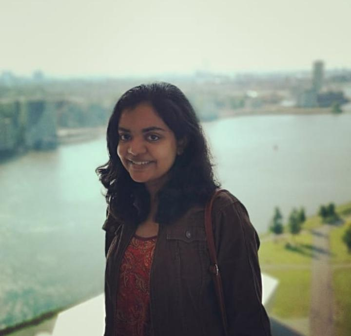

#  Amrita Suresh
I am a first year PhD student at the [LSV](https://www.lsv.fr), ENS Paris Saclay, under the supervision of [Alain Finkel](http://www.lsv.fr/~finkel) and [Benedikt Bollig](http://www.lsv.fr/~bollig).
My research is currently mainly focused on formal verification of infinite state systems, more specifically FIFO systems. I am studying underapproximations of the general model in hopes for finding expressive yet decidable subclasses. I really enjoy automata theory, logic, and the intersection of these topics with computational complexity.

 
  

# Research
## Publications
   +  B. Bollig, A. Finkel, and A. Suresh. *Bounded reachability problems are decidable in FIFO systems*, CONCUR'20
   

 
 
 

<!--
# Stuff
  [xsasd asd asd](Teaching)
  <a href="#opening">Take me to the opening paragraph.</a>
-->

<!--   -->